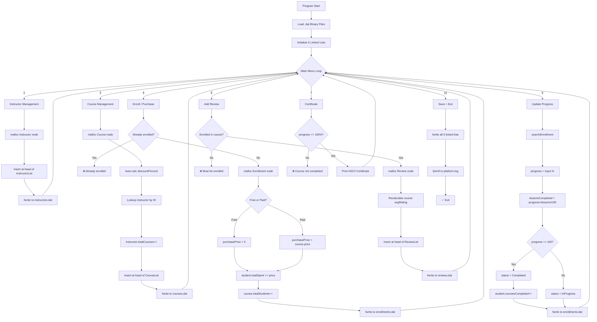

<div align="center">

# 📚 Online Course Platform Simulator

### *Udemy-like Learning Management System in C*

[](https://en.wikipedia.org/wiki/C_(programming_language))
[](https://github.com)
[](./LICENSE)
[](https://github.com/snehalathaArakkonam/online-course-platform-c)
[](https://github.com)
[](https://github.com)
[](https://github.com)
[](https://github.com)

> **A full-featured console-based Udemy-like course platform** built in pure C — featuring instructor & course management, student enrollment & progress tracking (0–100%), star ratings, certificate generation on completion, revenue analytics, category filtering, and persistent binary file storage across all entities.

[📌 Project Overview](#-project-overview) • [🧠 How It Works](#-how-it-works) • [📐 Architecture](#-system-architecture) • [🚀 Getting Started](#-getting-started) • [📊 Modules](#-modules) • [🎮 Sample I/O](#-sample-io--demo) • [📁 File Structure](#-file-structure)

</div>

---

## 📌 Project Overview

**Online Course Platform Simulator** is a **console-based C application** that replicates the full lifecycle of an online learning platform like Udemy — without any database, web server, or GUI. Instructors register and publish courses. Students register, enroll, purchase, track their progress lesson by lesson, leave reviews with star ratings, and earn a certificate upon 100% completion. Admins get a full revenue and engagement dashboard.

This project demonstrates mastery of:

| Concept | Implementation |
|---|---|
| **Linked Lists** | `Course*`, `Student*`, `Instructor*`, `Enrollment*`, `Review*` — all singly linked |
| **File Handling** | 5 binary `.dat` files + 1 text activity log |
| **Structures** | 5 core structs: Course, Student, Instructor, Enrollment, Review |
| **Sorting Algorithm** | Rating-based course ranking for Top Rated / Popular lists |
| **Math Algorithms** | Revenue split, discount %, avg rating recalculation, progress % |
| **Dynamic Memory** | `malloc()` for every new node across all 5 linked lists |
| **Modular C** | 10 separate `.c` files with clean separation of concerns |

---

## 🧠 How It Works

### The Big Picture

```
User Launches Program
        │
        ▼
┌────────────────────────────────────────────┐
│            MAIN MENU (loop)                │
│  1. Instructor Management                  │
│  2. Course Management   ───────────────►   │──► Linked List insert
│  3. Student Management                     │──► Binary file write
│  4. Enroll / Purchase Course               │──► Enrollment tracking
│  5. Update Progress         ───────────►   │──► 0–100% per lesson
│  6. Reviews & Ratings                      │──► Avg rating update
│  7. Certificate Generation ───────────►    │──► On 100% complete
│  8. Search & Filter                        │
│  9. Revenue Analytics                      │
│  10. Admin Dashboard                       │
│  11. Exit + Save                           │
└────────────────────────────────────────────┘
        │
        ▼
  All data persists in .dat binary files
```

### Step-by-Step User Journey

**Step 1 — Instructor Registers**
- `malloc()` a new `Instructor` node
- Set ID (auto-increment from list count)
- Fill: name, email, phone, bio, expertise
- Insert at head of `InstructorList` (linked list)
- `totalRevenue=0`, `totalCourses=0`, `avgRating=0`
- `joinDate = time(NULL)` (Unix timestamp)

**Step 2 — Instructor Creates a Course**
- `malloc()` a new `Course` node
- Enter: name, description, category, subcategory, instructorID, price, originalPrice, duration, lessons, level, language, certificate?, lifetime access?
- System auto-calculates: `discountPercent = ((originalPrice - price) / originalPrice) × 100`
- Looks up instructor by ID → copies instructor name → increments `instructor.totalCourses`
- `status = "Active"`, `rating = 0`, `totalStudents = 0`
- Insert at head of `CourseList`

**Step 3 — Student Registers**
- `malloc()` a new `Student` node
- Fill: name, email, phone, password, learning goals
- `totalSpent = 0`, `coursesEnrolled = 0`, `coursesCompleted = 0`

**Step 4 — Student Enrolls or Purchases**
- Lookup student and course by ID
- Check: already enrolled? → block with error
- `malloc()` new `Enrollment` node
  - `isFree=1` → `purchasePrice = 0` (free enrollment)
  - `isFree=0` → `purchasePrice = course.price` (paid purchase)
- Update student: `coursesEnrolled++`, `totalSpent += purchasePrice`
- Update course: `enrolledStudents++`, `totalStudents++`
- `status = "Enrolled"`, `progress = 0`

**Step 5 — Student Updates Progress**
```
progress input: 0–100 (integer %)
lessonsCompleted = (progress × totalLessons) / 100
if progress == 100:
    status = "Completed"
    completionDate = time(NULL)
    student.coursesCompleted++
else:
    status = "InProgress"
```

**Step 6 — Student Adds Review**
- Validates: must be enrolled in the course
- Enter rating (1–5 stars) + comment
- Updates course rating:
```
newRating = ((oldRating × oldReviewCount) + newRating) / newReviewCount
```
- `malloc()` new `Review` node → insert at head of `ReviewList`

**Step 7 — Certificate Generation**
- Only when `enrollment.status == "Completed"` (progress = 100%)
- Prints ASCII formatted certificate with: student name, course name, instructor, duration, completion date, enrollment ID

**Step 8 — Revenue Analytics**
```
courseRevenue      = course.price × course.purchasedStudents
totalPlatformRev   = Σ courseRevenue for all courses
instructorRevenue  = Σ (price × purchasedStudents) for instructor's courses
totalStudentSpent  = Σ student.totalSpent for all students
```

**Step 9 — Data Persistence**
- All struct lists saved as binary via `fwrite()` per session
- Loaded on startup via `fread()`
- `platform.log` gets `fprintf()` entries for every major action

---

## 📐 System Architecture

```
online-course-platform-c/
│
├── course_platform.c       ← MAIN FILE (entry point + menu loop)
├── instructor_module.c     ← Instructor CRUD + linked list
├── course_module.c         ← Course CRUD + search/filter/sort
├── student_module.c        ← Student CRUD + linked list
├── enrollment_module.c     ← Enroll/Purchase/Progress/Complete
├── review_module.c         ← Reviews + avg rating recalc
├── certificate_module.c    ← Certificate generation
├── revenue_module.c        ← Revenue analytics + splits
├── search_module.c         ← Filter by category/price/rating
├── admin_module.c          ← Admin dashboard
│
├── courses.dat             ← Binary: course linked list
├── students.dat            ← Binary: student linked list
├── instructors.dat         ← Binary: instructor linked list
├── enrollments.dat         ← Binary: enrollment records
├── reviews.dat             ← Binary: review records
├── platform.log            ← Text: timestamped activity log
│
├── Makefile                ← Build automation
├── .gitignore
├── LICENSE
└── README.md
```

---

## 🔬 Data Structures Deep Dive

### Instructor Node
```c
typedef struct Instructor {
    int   instructorID;
    char  name[50];
    char  email[50];
    char  phone[15];
    char  bio[500];
    char  expertise[100];
    float totalRevenue;
    int   totalCourses;
    int   totalStudents;
    float avgRating;
    char  profileImage[100];
    long  joinDate;               // Unix timestamp
    struct Instructor* next;      // Linked list pointer
} Instructor;
```

### Course Node
```c
typedef struct Course {
    int   courseID;
    char  courseName[100];
    char  courseDescription[1000];
    char  category[50];           // Programming | Design | Business
    char  subCategory[50];        // Web Dev | Python | UI/UX
    char  instructorName[50];
    int   instructorID;
    float price;
    float originalPrice;
    int   discountPercent;        // Auto-calculated
    int   duration;               // Total hours
    int   totalLessons;
    int   totalStudents;
    int   enrolledStudents;
    int   purchasedStudents;
    int   favoriteUsers;
    float rating;                 // Running avg 1.0–5.0
    int   totalReviews;
    char  level[20];              // Beginner | Intermediate | Advanced
    char  language[20];
    int   hasCertificate;         // 1=YES, 0=NO
    int   hasLifetimeAccess;      // 1=YES, 0=NO
    char  status[20];             // Active | Draft | Archived
    long  createdDate;
    struct Course* next;          // Linked list pointer
} Course;
```

### Student Node
```c
typedef struct Student {
    int   studentID;
    char  name[50];
    char  email[50];
    char  phone[15];
    char  password[20];
    float totalSpent;
    int   coursesEnrolled;
    int   coursesCompleted;
    int   coursesPurchased;
    int   favoriteCourses;
    char  learningGoals[500];
    long  joinDate;
    struct Student* next;         // Linked list pointer
} Student;
```

### Enrollment Node
```c
typedef struct Enrollment {
    int   enrollmentID;
    int   studentID;
    int   courseID;
    int   progress;               // 0–100 %
    int   lessonsCompleted;
    int   totalLessons;
    float purchasePrice;
    long  enrollDate;
    long  completionDate;
    char  status[20];             // Enrolled | InProgress | Completed
    struct Enrollment* next;
} Enrollment;
```

### Review Node
```c
typedef struct Review {
    int  reviewID;
    int  studentID;
    int  courseID;
    char studentName[50];
    int  rating;                  // 1–5 stars
    char comment[500];
    long reviewDate;
    struct Review* next;
} Review;
```

### Discount Calculation
```c
if(originalPrice > price) {
    discountPercent = ((originalPrice - price) / originalPrice) × 100;
}
// Example: Original ₹999, Sale ₹499 → 50% off
```

### Rating Update Algorithm (Running Average)
```c
// When new review comes in:
course->totalReviews++;
course->rating = ((course->rating × (course->totalReviews - 1)) + newRating)
                  / course->totalReviews;
// Keeps rating accurate without storing all past ratings
```

### Revenue Formula
```c
courseRevenue     = course.price × course.purchasedStudents
platformRevenue   = Σ courseRevenue (all courses)
instructorRevenue = Σ courseRevenue (instructor's courses only)
```

---

## 📊 Modules

### Module 1 — Instructor Management (`instructor_module.c`)

| Function | Description |
|---|---|
| `addInstructor()` | Register with name, email, expertise; auto-ID |
| `displayAllInstructors()` | Walk linked list, print all profiles |
| `searchInstructor()` | Find by ID or name |
| `updateInstructor()` | Edit profile fields |
| `instructorCourses()` | Filter course list by instructorID |
| `instructorRevenue()` | Sum revenue across instructor's courses |
| `instructorReport()` | Stats: total courses, students, avg rating |

### Module 2 — Course Management (`course_module.c`)

| Function | Description |
|---|---|
| `addCourse()` | Full course creation with auto discount calc |
| `displayAllCourses()` | Rich table: price, discount, rating, features |
| `searchCourse()` | Search by name or category keyword |
| `filterCourses()` | Filter by category + price range |
| `searchByInstructor()` | All courses by a given instructor |
| `topRatedCourses()` | Top 5 by rating (sorting pass over list) |
| `popularCourses()` | Top 5 by student count |
| `courseReport()` | Stats: count, avg price, avg rating |

### Module 3 — Student Management (`student_module.c`)

| Function | Description |
|---|---|
| `addStudent()` | Register with name, email, password, goals |
| `displayAllStudents()` | List all students with spend stats |
| `searchStudent()` | Find by ID or email |
| `updateStudent()` | Edit profile |
| `enrolledCourses()` | Filter enrollment list by studentID |
| `purchasedCourses()` | Show only purchased (paid) enrollments |
| `studentReport()` | Stats: total enrolled, completed, spent |

### Module 4 — Enrollment (`enrollment_module.c`)

| Function | Description |
|---|---|
| `enrollCourse()` | Free enrollment — `purchasePrice = 0` |
| `purchaseCourse()` | Paid enrollment — deduct from student wallet |
| `updateProgress()` | Set 0–100%, auto-calc lessons done |
| `completeCourse()` | Set 100%, trigger `coursesCompleted++` |
| `enrollmentReport()` | Count by status: Enrolled / InProgress / Completed |

### Module 5 — Reviews & Ratings (`review_module.c`)

| Function | Description |
|---|---|
| `addReview()` | Enrollment check → 1–5 stars + comment |
| `displayReviews()` | All reviews for a course ID |
| `searchReviews()` | Filter by student or course |
| `updateReview()` | Edit existing review |
| `averageRating()` | Recalculate and display avg for course |

### Module 6 — Certificate Generation (`certificate_module.c`)

| Function | Description |
|---|---|
| `generateCertificate()` | ASCII bordered certificate on 100% completion |

### Module 7 — Revenue Analytics (`revenue_module.c`)

| Function | Description |
|---|---|
| `revenueReport()` | Per-course revenue + platform total |
| `instructorRevenue()` | Revenue per instructor |

### Module 8 — Search & Filter (`search_module.c`)

| Function | Description |
|---|---|
| `filterByCategory()` | Show all courses matching a category string |
| `filterByPrice()` | Show courses within ₹min–₹max range |
| `filterByLevel()` | Beginner / Intermediate / Advanced filter |
| `filterByRating()` | Courses above a minimum star rating |

### Module 9 — Admin Dashboard (`admin_module.c`)

| Function | Description |
|---|---|
| `adminDashboard()` | Totals: courses, students, instructors, enrollments, revenue |

---

## 🗄️ File Handling

### Binary Files (`.dat`)

| File | Contents | Mode |
|---|---|---|
| `courses.dat` | All `Course` struct nodes | `rb+` / `wb+` |
| `students.dat` | All `Student` struct nodes | `rb+` / `wb+` |
| `instructors.dat` | All `Instructor` struct nodes | `rb+` / `wb+` |
| `enrollments.dat` | All `Enrollment` nodes | `ab+` / `rb+` |
| `reviews.dat` | All `Review` nodes | `ab+` / `rb+` |

### Text Log

| File | Contents |
|---|---|
| `platform.log` | Timestamped entries: course created, enrolled, purchased, reviewed, completed, errors |

### File Operations
```c
fopen()    // rb+ (read binary), wb+ (write binary), ab+ (append binary)
fwrite()   // Serialize struct to binary file
fread()    // Deserialize struct from binary file
fprintf()  // Write timestamped line to platform.log
fclose()   // Always close after every operation
// NULL check: if fopen() returns NULL → auto-create fresh file
```

---

## 🚀 Getting Started

### Prerequisites
```bash
# Linux / macOS
gcc --version    # GCC 9+ recommended
make --version   # GNU Make

# Windows: use MinGW or WSL
```

### Installation & Build
```bash
# 1. Clone the repository
git clone https://github.com/snehalathaArakkonam/online-course-platform-c.git
cd online-course-platform-c

# 2. Build with Makefile
make

# 3. Run
./course_platform
```

### Manual Compile (no Make)
```bash
gcc -o course_platform course_platform.c instructor_module.c course_module.c \
    student_module.c enrollment_module.c review_module.c certificate_module.c \
    revenue_module.c search_module.c admin_module.c -lm

./course_platform
```

---

## 🎮 Sample I/O — Demo

### ▶ Program Start

```
========================================
    ONLINE COURSE PLATFORM
    Udemy-like Learning Simulator
========================================
1.  Instructor Management
2.  Course Management
3.  Student Management
4.  Enroll / Purchase Course
5.  Update Progress
6.  Reviews & Ratings
7.  Certificate Generation
8.  Search & Filter
9.  Revenue Analytics
10. Admin Dashboard
11. Exit
========================================
Enter choice:
```

---

### ▶ Option 1 — Register Instructor

**Input:**
```
Enter choice: 1

=== REGISTER INSTRUCTOR ===
Name: Dr. Rajesh Kumar
Email: rajesh@email.com
Phone: 9876543210
Bio: Expert Python developer with 10 years experience
Expertise: Python Programming
```

**Output:**
```
✅ Instructor registered successfully!
 Instructor ID: 1
 Name: Dr. Rajesh Kumar
 Expertise: Python Programming
```

---

### ▶ Option 2 — Create Course

**Input:**
```
Enter choice: 2

=== CREATE NEW COURSE ===
Course Name: Complete Python Bootcamp
Description: Master Python from scratch to advanced
Category: Programming
Sub Category: Python
Instructor ID: 1
Price: ₹499
Original Price: ₹999
Duration (hours): 20
Total Lessons: 100
Level: Beginner
Language: English
Has Certificate (1=YES/0=NO): 1
Has Lifetime Access (1=YES/0=NO): 1
```

**Output:**
```
✅ Course created successfully!
 Course ID: 1
 Name: Complete Python Bootcamp
 Price: ₹499 (50% OFF from ₹999)
 Category: Programming / Python
 Instructor: Dr. Rajesh Kumar
 🎓 Certificate Available
 ⏰ Lifetime Access
```

---

### ▶ Option 2 — Display All Courses

**Input:** `2` → View All Courses

**Output:**
```
========================================
    ALL COURSES
========================================

1. Complete Python Bootcamp
   Course ID: 1
   Instructor: Dr. Rajesh Kumar
   Category: Programming / Python
   Level: Beginner | Language: English
   Duration: 20 hours | Lessons: 100
   Price: ₹499 (Original: ₹999 | Discount: 50%)
   Students: 0 | Rating: 0.00★ (0 reviews)
   🎓 Certificate Available
   ⏰ Lifetime Access
   Status: Active
========================================
```

---

### ▶ Option 3 — Register Student

**Input:**
```
Enter choice: 3

=== REGISTER STUDENT ===
Name: Amit Sharma
Email: amit@email.com
Phone: 9876543211
Learning Goals: Become a Python developer
```

**Output:**
```
✅ Student registered successfully!
 Student ID: 1
 Name: Amit Sharma
 Email: amit@email.com
```

---

### ▶ Option 4 — Purchase Course

**Input:**
```
Enter choice: 4

Student ID: 1
Course ID: 1
Purchase (1) or Free Enroll (0): 1
```

**Output:**
```
✅ Course purchased successfully!
 Course: Complete Python Bootcamp
 Price: ₹499.00
 Total Spent: ₹499.00
 Progress: 0%
 Status: Enrolled
```

---

### ▶ Option 5 — Update Progress

**Input:**
```
Enter choice: 5

Student ID: 1
Course ID: 1
Progress (%): 50
```

**Output:**
```
✅ Progress updated!
 Course ID: 1
 Progress: 50%
 Lessons: 50 / 100
 Status: InProgress
```

**Input (Complete):**
```
Progress (%): 100
```

**Output:**
```
🎉 COURSE COMPLETED!
✅ Progress updated!
 Course ID: 1
 Progress: 100%
 Lessons: 100 / 100
 Status: Completed
```

---

### ▶ Option 6 — Add Review

**Input:**
```
Enter choice: 6

Student ID: 1
Course ID: 1
Rating (1-5): 5
Enter Review Comment: Excellent course, very well structured!
```

**Output:**
```
✅ Review added successfully!
 Rating: 5★
 Course Rating: 5.00★ (1 review)
```

---

### ▶ Option 7 — Certificate Generation

**Input:**
```
Enter choice: 7
Student ID: 1
Course ID: 1
```

**Output:**
```
========================================
         CERTIFICATE OF COMPLETION
========================================

   This is to certify that

   Amit Sharma

   Has successfully completed the course

   Complete Python Bootcamp

   Course ID:        1
   Instructor:       Dr. Rajesh Kumar
   Duration:         20 hours
   Total Lessons:    100
   Completion Date:  26/06/2026
   Enrollment ID:    1

========================================
         PLATFORM: Online Course Platform
========================================

🎓 Certificate Generated Successfully!
```

---

### ▶ Option 8 — Search & Filter

**Input:**
```
Enter choice: 8

Filter by Category: Programming
```

**Output:**
```
========================================
    COURSES IN: Programming
========================================

1. Complete Python Bootcamp
   Price: ₹499.00
   Rating: 5.00★
   Students: 1

Total: 1 courses
========================================
```

**Filter by Price:**
```
Min Price: 0
Max Price: 600
```

**Output:**
```
========================================
    COURSES: ₹0.00 - ₹600.00
========================================

1. Complete Python Bootcamp
   Price: ₹499.00
   Rating: 5.00★

Total: 1 courses
========================================
```

---

### ▶ Option 9 — Revenue Analytics

**Input:** `9`

**Output:**
```
========================================
    REVENUE ANALYTICS
========================================

Course: Complete Python Bootcamp
   Price: ₹499.00
   Purchased: 1
   Revenue: ₹499.00

========================================
TOTAL PLATFORM REVENUE: ₹499.00
TOTAL STUDENT SPENT:    ₹499.00
========================================

    INSTRUCTOR REVENUE
========================================

Instructor: Dr. Rajesh Kumar
   Courses: 1
   Students: 1
   Revenue: ₹499.00
========================================
```

---

### ▶ Option 10 — Admin Dashboard

**Input:** `10`

**Output:**
```
========================================
    ADMIN DASHBOARD
========================================

Total Courses:      5
Total Students:     10
Total Instructors:  3
Total Enrollments:  15

Total Revenue: ₹2,500.00

Top Course by Revenue:
  Complete Python Bootcamp — ₹499.00

Top Course by Students:
  Complete Python Bootcamp — 1 students
========================================
```

---

### ▶ Option 11 — Exit

```
Course platform data saved successfully!
Thank you for using Online Course Platform!
```

---

## 🗺️ System Flow Diagram



---

## 🔢 Mathematical Formulas Used

```
Discount %        = ((originalPrice - price) / originalPrice) × 100

lessonsCompleted  = (progress × totalLessons) / 100

avgRating (new)   = ((oldRating × (totalReviews-1)) + newRating) / totalReviews

courseRevenue     = price × purchasedStudents

platformRevenue   = Σ courseRevenue for all courses

instructorRevenue = Σ courseRevenue for instructor's courses

completionRate    = (coursesCompleted / coursesEnrolled) × 100

enrollRate        = (totalStudents / listCount) as ratio
```

---

## ⚠️ Input Validation Rules

| Input | Validation |
|---|---|
| Instructor ID (course creation) | Must exist in InstructorList |
| Course price | Must be > 0; `originalPrice >= price` |
| Enrollment | Must not already be enrolled in same course |
| Progress | Must be 0–100 integer; rejects negative/over-100 |
| Certificate | Only generated if `enrollment.status == "Completed"` |
| Review | Student must be enrolled in the course being reviewed |
| Rating | Must be 1–5 integer |
| Menu choice | 1–11 only; invalid re-prompts without crashing |
| File open | If `fopen()` returns NULL → auto-create file fresh |

---

## 🧩 Key Concepts Demonstrated

```
✅ Linked Lists          → 5 singly-linked lists (Course, Student, Instructor, Enrollment, Review)
✅ Dynamic Memory        → malloc() for every new node; no fixed arrays
✅ File Handling         → fwrite/fread binary structs; fprintf text log
✅ Structures            → Course, Student, Instructor, Enrollment, Review
✅ Sorting Algorithm     → Rating/student-count based ranking for Top lists
✅ Math Algorithms       → Discount %, running avg rating, revenue split, progress %
✅ Certificate Engine    → ASCII certificate triggered on 100% completion
✅ Enrollment System     → Free vs paid, duplicate check, progress tracking
✅ Revenue Analytics     → Per-course, per-instructor, platform total
✅ Search & Filter       → Category, price range, level, rating threshold
✅ Input Validation      → Every input validated before list/file operation
✅ Modular C Design      → 10 separate .c files, zero spaghetti code
```

---

## 📁 File Structure

```
online-course-platform-c/
│
├── 📄 course_platform.c        ← Main file (800+ lines)
├── 📄 instructor_module.c      ← Instructor functions (180 lines)
├── 📄 course_module.c          ← Course functions (220 lines)
├── 📄 student_module.c         ← Student functions (180 lines)
├── 📄 enrollment_module.c      ← Enrollment functions (180 lines)
├── 📄 review_module.c          ← Review functions (140 lines)
├── 📄 certificate_module.c     ← Certificate generation (120 lines)
├── 📄 revenue_module.c         ← Revenue analytics (140 lines)
├── 📄 search_module.c          ← Search & filter (120 lines)
├── 📄 admin_module.c           ← Admin dashboard (120 lines)
│
├── 🗄️  courses.dat              ← Binary course database
├── 🗄️  students.dat             ← Binary student database
├── 🗄️  instructors.dat          ← Binary instructor database
├── 🗄️  enrollments.dat          ← Binary enrollment records
├── 🗄️  reviews.dat              ← Binary review records
├── 📝 platform.log             ← Text activity log
│
├── 🔧 Makefile                 ← Build automation
├── 📄 .gitignore
├── 📄 LICENSE
└── 📄 README.md
```

---

## 👩‍💻 Author

<div align="center">

**Snehalatha Arakkonam**
*B.Tech CSE — AI & ML Specialization*

[](https://github.com/snehalathaArakkonam)

</div>

---

<div align="center">

*📚 Built with pure C — No database. No GUI. No real payments. Just clean systems programming.*

</div>
